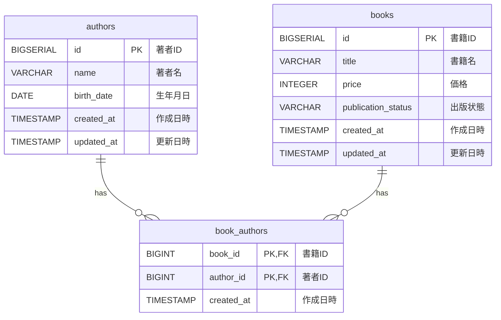

# DB設計書

<details>
<summary>1. 目的</summary>

本ドキュメントは、書籍管理システムのバックエンドAPIで使用するDB設計を定義する。

本システムでは、著者と書籍を多対多の関係として扱うため、以下の3テーブルを使用する。

| テーブル | 用途 |
|---|---|
| authors | 著者情報を管理する |
| books | 書籍情報を管理する |
| book_authors | 書籍と著者の多対多関連を管理する |

</details>

<details>
<summary>2. ER概要</summary>



### 関連概要

- 1人の著者は複数の書籍に紐づけられる
- 1冊の書籍は複数の著者に紐づけられる
- `book_authors` は中間テーブルとして利用する
- `book_authors.book_id` と `book_authors.author_id` の複合主キーにより、同じ書籍と著者の組み合わせが重複登録されないようにする
- 著者別書籍取得APIでは `book_authors.author_id` を検索条件にするため、`author_id` にインデックスを設定する

</details>

<details>
<summary>3. authors テーブル</summary>

## 3.1 用途

著者情報を管理する。

## 3.2 カラム定義

| カラム | 型 | NULL | デフォルト | 内容 |
|---|---|---|---|---|
| id | BIGSERIAL | NOT NULL | 自動採番 | 著者ID |
| name | VARCHAR(255) | NOT NULL | なし | 著者名 |
| birth_date | DATE | NOT NULL | なし | 生年月日 |
| created_at | TIMESTAMP | NOT NULL | CURRENT_TIMESTAMP | 作成日時 |
| updated_at | TIMESTAMP | NOT NULL | CURRENT_TIMESTAMP | 更新日時 |

## 3.3 制約

| 制約名 | 内容 |
|---|---|
| PRIMARY KEY | id |
| chk_authors_birth_date | birth_date <= CURRENT_DATE |

## 3.4 DDL案

```sql
CREATE TABLE authors (
  id BIGSERIAL PRIMARY KEY,
  name VARCHAR(255) NOT NULL,
  birth_date DATE NOT NULL,
  created_at TIMESTAMP NOT NULL DEFAULT CURRENT_TIMESTAMP,
  updated_at TIMESTAMP NOT NULL DEFAULT CURRENT_TIMESTAMP,
  CONSTRAINT chk_authors_birth_date CHECK (birth_date <= CURRENT_DATE)
);
```

</details>

<details>
<summary>4. books テーブル</summary>

## 4.1 用途

書籍情報を管理する。

## 4.2 カラム定義

| カラム | 型 | NULL | デフォルト | 内容 |
|---|---|---|---|---|
| id | BIGSERIAL | NOT NULL | 自動採番 | 書籍ID |
| title | VARCHAR(255) | NOT NULL | なし | 書籍名 |
| price | INTEGER | NOT NULL | なし | 価格 |
| publication_status | VARCHAR(20) | NOT NULL | なし | 出版状態 |
| created_at | TIMESTAMP | NOT NULL | CURRENT_TIMESTAMP | 作成日時 |
| updated_at | TIMESTAMP | NOT NULL | CURRENT_TIMESTAMP | 更新日時 |

## 4.3 制約

| 制約名 | 内容 |
|---|---|
| PRIMARY KEY | id |
| chk_books_price | price >= 0 |
| chk_books_publication_status | publication_status IN ('UNPUBLISHED', 'PUBLISHED') |

## 4.4 DDL案

```sql
CREATE TABLE books (
  id BIGSERIAL PRIMARY KEY,
  title VARCHAR(255) NOT NULL,
  price INTEGER NOT NULL,
  publication_status VARCHAR(20) NOT NULL,
  created_at TIMESTAMP NOT NULL DEFAULT CURRENT_TIMESTAMP,
  updated_at TIMESTAMP NOT NULL DEFAULT CURRENT_TIMESTAMP,
  CONSTRAINT chk_books_price CHECK (price >= 0),
  CONSTRAINT chk_books_publication_status CHECK (publication_status IN ('UNPUBLISHED', 'PUBLISHED'))
);
```

</details>

<details>
<summary>5. book_authors テーブル</summary>

## 5.1 用途

書籍と著者の多対多関連を管理する。

## 5.2 カラム定義

| カラム | 型 | NULL | デフォルト | 内容 |
|---|---|---|---|---|
| book_id | BIGINT | NOT NULL | なし | 書籍ID |
| author_id | BIGINT | NOT NULL | なし | 著者ID |
| created_at | TIMESTAMP | NOT NULL | CURRENT_TIMESTAMP | 作成日時 |

## 5.3 制約

| 制約名 | 内容 |
|---|---|
| PRIMARY KEY | book_id, author_id |
| fk_book_authors_book_id | book_id は books.id を参照 |
| fk_book_authors_author_id | author_id は authors.id を参照 |

## 5.4 インデックス

| インデックス名 | 対象カラム | 用途 |
|---|---|---|
| idx_book_authors_author_id | author_id | 著者別書籍取得APIで、著者IDを条件に書籍を検索するため |

## 5.5 DDL案

```sql
CREATE TABLE book_authors (
  book_id BIGINT NOT NULL,
  author_id BIGINT NOT NULL,
  created_at TIMESTAMP NOT NULL DEFAULT CURRENT_TIMESTAMP,
  PRIMARY KEY (book_id, author_id),
  CONSTRAINT fk_book_authors_book_id FOREIGN KEY (book_id) REFERENCES books(id) ON DELETE CASCADE,
  CONSTRAINT fk_book_authors_author_id FOREIGN KEY (author_id) REFERENCES authors(id) ON DELETE RESTRICT
);

CREATE INDEX idx_book_authors_author_id
  ON book_authors(author_id);
```

</details>

<details>
<summary>6. テーブル関連</summary>

## 6.1 authors と book_authors

- `authors.id` と `book_authors.author_id` で関連する
- 著者が書籍に紐づいている場合、著者削除は制限する
- 今回のAPIでは著者削除は実装対象外とする
- 著者別書籍取得では `book_authors.author_id` を条件に検索する

## 6.2 books と book_authors

- `books.id` と `book_authors.book_id` で関連する
- 書籍削除時は `book_authors` も削除される設計とする
- 今回のAPIでは書籍削除は実装対象外とするが、DB整合性を考慮して `ON DELETE CASCADE` を設定する

</details>

<details>
<summary>7. DB制約とアプリケーション制約の役割分担</summary>

| 制約 | DB制約 | アプリケーション制約 | 理由 |
|---|---|---|---|
| 著者名必須 | NOT NULL | 空文字チェック | DBでは空文字までは防ぎにくいため |
| 生年月日は現在日以前 | CHECK | Serviceでチェック | APIで分かりやすいエラーを返すため |
| 書籍名必須 | NOT NULL | 空文字チェック | DBでは空文字までは防ぎにくいため |
| 価格は0以上 | CHECK | Serviceでチェック | DB不整合防止とAPIエラー制御の両方が必要なため |
| 出版状態は定義値のみ | CHECK | enumでチェック | 不正な状態をDB・アプリ両方で防ぐため |
| 書籍には1人以上の著者が必要 | なし | Serviceでチェック | 中間テーブルを含む業務ルールのため |
| 出版済みから未出版へ戻せない | なし | Serviceでチェック | 更新前状態との比較が必要なため |
| 存在しない著者を紐づけない | FK | Serviceでチェック | DB不整合防止とAPIエラー制御の両方が必要なため |

</details>

<details>
<summary>8. インデックス方針</summary>

本課題ではデータ量が限定的な想定のため、過度なインデックス設計は行わない。

ただし、今回の必須APIである著者別書籍取得では `author_id` 起点で `book_authors` を検索するため、`book_authors.author_id` のインデックスは初期マイグレーションに含める。

| 対象 | 用途 | 採用判断 |
|---|---|---|
| authors.id | 著者検索 | 主キーとして採用 |
| books.id | 書籍検索 | 主キーとして採用 |
| book_authors(book_id, author_id) | 書籍と著者の紐づけ一意性 | 複合主キーとして採用 |
| book_authors.author_id | 著者別書籍取得 | インデックスとして採用 |

`idx_book_authors_author_id` は、今回の主要ユースケースに直結する検索条件であるため、過剰なインデックスではなく、最小限必要な性能・設計配慮として採用する。

```sql
CREATE INDEX idx_book_authors_author_id
  ON book_authors(author_id);
```

</details>

<details>
<summary>9. Flyway方針</summary>

## 9.1 マイグレーションファイル

初期マイグレーションは以下の1ファイルとする。

```text
src/main/resources/db/migration/V1__create_tables.sql
```

## 9.2 管理方針

- テーブル作成はFlywayで管理する
- `idx_book_authors_author_id` は初期マイグレーション `V1__create_tables.sql` に含める
- jOOQコード生成はFlyway適用後のDBスキーマを元に行う
- 初期構築時点ではV1に集約する
- 後続変更が発生した場合のみV2以降を追加する

</details>

<details>
<summary>10. jOOQコード生成との関係</summary>

- FlywayでDBスキーマを作成する
- 作成済みDBスキーマからjOOQコードを生成する
- Repository層ではjOOQの生成テーブルクラスを利用する
- 生SQL文字列の多用は避ける
- 著者別書籍取得では、`book_authors.author_id` を条件に `books` とjoinする

</details>

<details>
<summary>11. 補足</summary>

- `created_at` / `updated_at` は簡易的にDBデフォルト値で管理する
- 更新時はアプリケーション側で `updated_at = CURRENT_TIMESTAMP` を設定する
- 著者削除・書籍削除は今回のAPI対象外とする
- 書籍と著者の関連更新では、既存の関連を削除してから再登録する方針とする
- `book_authors.author_id` のインデックスは、著者別書籍取得APIの主要検索条件に合わせて採用する

</details>
